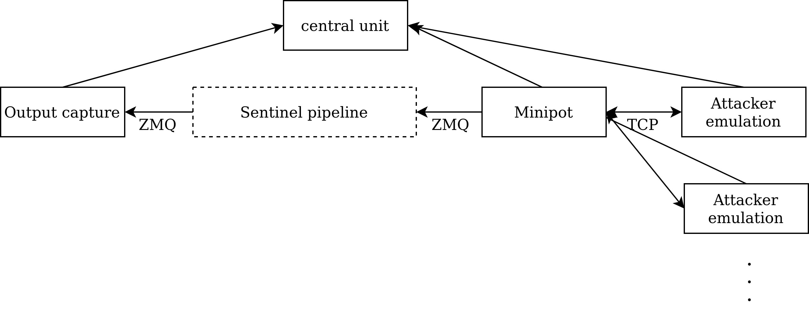

# Integration testing framework
It serves for overall testing of `Minipots` component `../../../doc/main.md`
functionality and minipots pipeline composed from multiple Sentinel components.

There are two key points for `Minipots` correct functionality:
- client-server (attacker-minipot) communication
- reporting Sentinel messages (recorded events) to Sentinel-Proxy throught
ZMQ socket

The core functionality of minipots pipeline is in general to transform data
generated by `Minipots` passing throught the pipeline. A format of data leaving
the pipeline is defined by its components. To verify wether the pipeline works
correctly the real output must be compared with designed intended output.

## Key functionalities
This framework provides a flexible environment for the following tasks:
- `Minipots` input generation
- `Minipots` intended output generation based on given input
- Interactions with `Minipots` component
- minipots pipeline output capture
- Comparison of real captured output with the generated intended output

## Architecture design
Based on the framework functionalities the following architecture is designed:

**Attacker emulation** generates `Minipots` input and `Minipots` intended output
based on the generated input. It sends generated input to `Minipots`. It
receives and checks the correctness of the received data on a TCP connection.
The generated intended `Minipots` output is also sent to Central unit for later comparison.

**Output capture** captures output from Minipot and forwards it to Central unit.

**Central unit** receives captured `Minipots` or pipleine output and intended
generated output from Attacker emulation. The both outputs are then compared.

## Evaluation process
The communication of `Minipots` and Attacker emulation is validated in realtime
by Attacker emulation component. If the response received from Minipot is not
correct, the testing is immediately terminated with the negative result.
`Minipots` outputs are checked after all the interactions between `Minipots` and
Attacker emulation components if the Minipot passes it. If there is any
message mismatch between messages generated by Attacker emulation and `Minipots`,
the Minipot failed the test.

## Implementation 
Main unit of the framework is `Test` class. It is implementation of Central unit.
Attacker emulations and Output capture componennts are implemented as a functions
which are passed as input arguments to `Test` class constructor.

### Attacker emulation
It is simple routine implementing client-server (attacker-minipots)
communication and validates it. It also generates intended Sentinel messages which
real `Minipots` component should generate for later matching. 

### Output capture
It is simple routine implemented to listen and poll arriving data from given ZMQ
socket - end of the minipots pipeline. It unpacks receieved data serialized
by MessagePack and removes some fields (ts, id, device_token) from Sentinel
messages to allow exact matching of Attacker emulation generated and Output
capture captured messages.

### Test class
The central unit is implemented as a class with a single method run.
Threadpool is used to run Attacker emulations on given Internet endpoints
and Output capture on gievn ZMQ socket. After all the threads finish their jobs,
generated and captured Sentinel messages are matched against each others.

